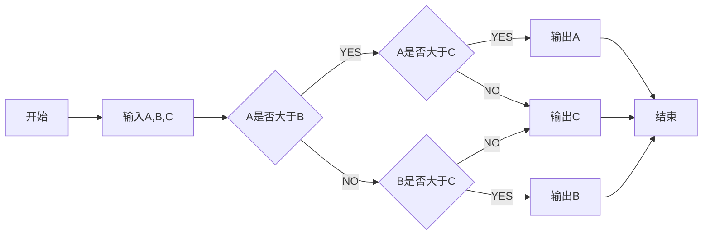

# RM2019SummerCamp
All the codes for the robomaster 2019 high school summer camp
Our Process：

 ***
Staffing table:

Embedded System|Algorithm|Mechanics
---|:--:|---:
Liao Qiayuan |Wang Guan|Chen Wenxiao
